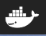
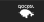
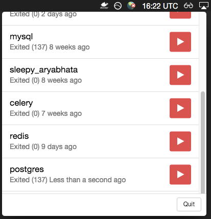
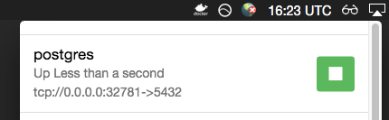

docker-indicator
----------------

Shows an icon in the menu bar with the status of docker.

**Why?**

I often forget if docker is running and this gives a quick visual.

## Status

running (can make a connection)

not running (or at least cannot connect to one)

Stopped container list

Started container list (shows on top)

## Usage

This is very early in development.
Start with `npm start` or `electron .` from the repo directory.

## Changelog

0.0.1
* UI reacts to Docker events
* Start/Stop buttons work on containers

## TODO

* use docker machine settings if available
* ui errors, better state management, etc.
* fix build command
* build (icons, size, packaging, etc.)
* configuration via ui?
